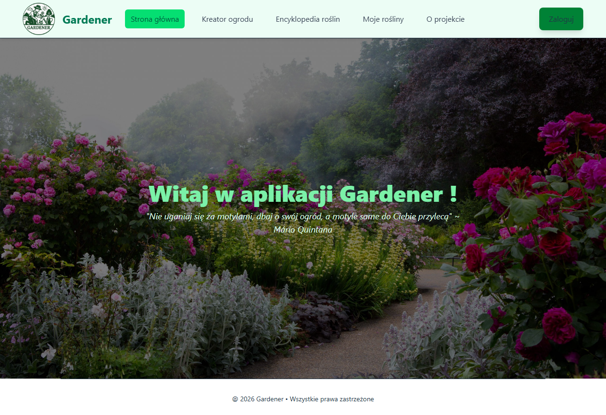

# Accessibility Bug Report - A11Y-001 - Login button does not meet WCAG AA contrast requirements

## Summary

The "Zaloguj" button displayed on the Home Page does not meet the minimum contrast ratio required by WCAG 2.1 AA. The contrast ratio between the text and background is 2.55:1, which is below the required 4.5:1 threshold.

---

## Environment

| Field        | Value                 |
| ------------ | --------------------- |
| Frontend URL | http://localhost:4173 |
| Browser      | Chromium              |
| OS           | Windows 10            |
| Date Found   | 2026-06-17            |

---

## Severity

* [ ] Critical
* [ ] Major
* [x] Minor

---

## Status

* [x] New
* [ ] In Progress
* [ ] Fixed
* [ ] Closed

---

## Affected Page

Page: Home Page

Theme:

* [x] Light
* [ ] Dark

---

## Accessibility Details

| Field          | Value  |
| -------------- | -------|
| WCAG Criterion | 1.4.3 Contrast (Minimum)  |
| WCAG Level     |     AA  |
| Tool           | axe-core  |
| Impact         | serious |
| Affected Users | Users with low vision, color vision deficiencies |

---

## Expected Result

The button text should meet WCAG AA accessibility requirements with a minimum contrast ratio of 4.5:1.

---

## Actual Result

The button text has a contrast ratio of 2.55:1 against the background color, failing WCAG AA requirements.

---

## Axe Findings

### Element

```html
<a
  class="px-5 py-3 bg-green-700 rounded-lg hover:bg-green-500 shadow-lg duration-200 transition-all"
  href="/user-login-form"
>
  Zaloguj
</a>
```

### Contrast Analysis

| Property         | Value   |
| ---------------- | ------- |
| Foreground Color | #213547 |
| Background Color | #008236 |
| Actual Ratio     | 2.55:1  |
| Required Ratio   | 4.5:1   |

---

## Evidence

Screenshot:


---

## Notes

Foreground and/or background colors should be adjusted to achieve a minimum contrast ratio of 4.5:1 as required by WCAG 2.1 AA.