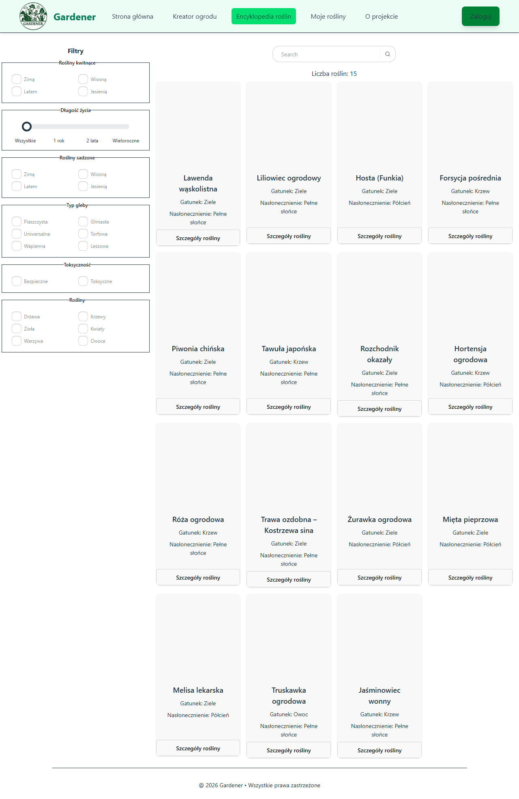

# Accessibility Bug Report - A11Y-002 - Filter text does not meet WCAG AA contrast requirements

## Summary

Text labels in the filter section do not meet the minimum contrast ratio required by WCAG 2.1 AA. The contrast ratio between the text and background is 3.71, which is below the required 4.5:1 threshold.

---

## Environment

| Field        | Value                 |
| ------------ | --------------------- |
| Frontend URL | http://localhost:4173 |
| Browser      | Chromium              |
| OS           | Windows 10            |
| Date Found   | 2026-06-17            |

---

## Severity

* [ ] Critical
* [ ] Major
* [x] Minor

---

## Status

* [x] New
* [ ] In Progress
* [ ] Fixed
* [ ] Closed

---

## Affected Page

Page: `PlantPage`

Theme:

* [x] Light
* [ ] Dark

---

## Accessibility Details

| Field          | Value    |
| -------------- | -------- |
| WCAG Criterion |    1.4.3 Contrast (Minimum)|
| WCAG Level     |     AA    |
| Tool           | axe-core |
| Impact         |     Serious     |
| Affected Users |    Users with low vision, color vision deficiencies      |

---

## Expected Result

The text should meet WCAG AA accessibility requirements with a minimum contrast ratio of 4.5:1.

---

## Actual Result

The elements have insufficient contrast ratio of 3.71 not meet WCAG AA requirements.

---

## Axe Findings

### Elements

```html
<label class="label"><input class="checkbox" type="checkbox">Zimą</label>
<label class="label"><input class="checkbox" type="checkbox">Lessowa</label>
<label class="label lg:col-span-1"><input class="checkbox" type="checkbox">Toksyczne</label>
<label class="label"><input class="checkbox" type="checkbox">Drzewa</label>
```
The issue affects multiple filter labels within the filter section. Not all labels are affected.

### Contrast Analysis

| Property         | Value |
| ---------------- | ----- |
| Foreground Color |   #7a8691    |
| Background Color |   #ffffff    |
| Actual Ratio     |    3.71   |
| Required Ratio   | 4.5:1 |

---

## Evidence

Screenshot:


---

## Notes

Foreground and/or background colors should be adjusted to achieve a minimum contrast ratio of 4.5:1 as required by WCAG 2.1 AA.