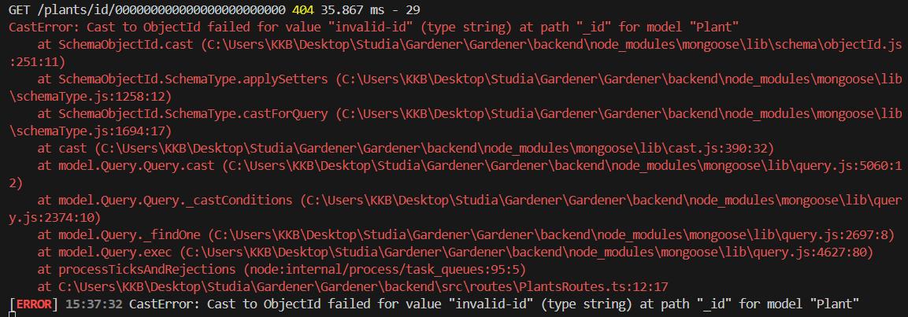
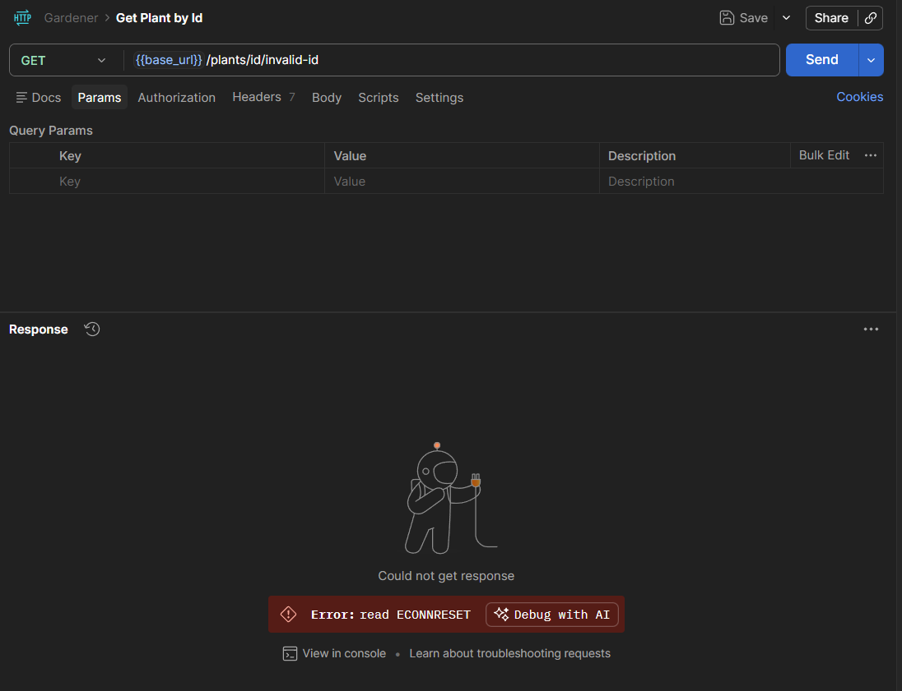

# Bug Report – BUG-003 – GET /plants/id/:id returns HTTP 404 instead of HTTP 400 for invalid ID format

## Summary

Sending GET /plants/id/:id with a non-ObjectId plantId value causes an unhandled CastError that crashes the backend server. No HTTP response is returned to the client and the server requires a manual restart.

---

## Environment

| Field | Value |
|---|---|
| Frontend URL | http://localhost:4173 |
| Backend | http://localhost:3001 |
| Database | MongoDB Cloud |
| Browser | Chromium |
| OS | Windows 10 |
| Date found | 2026-03-08 |

---

## Severity

- [x] Critical
- [ ] Major
- [ ] Minor

---

## Status

- [x] New
- [ ] In progress
- [ ] Fixed
- [ ] Closed

---

## Related Test Case

TC ID: `PLANT-05`

---

## Steps to Reproduce

1. Send GET /plants/id/invalid-id
   - No Authorization header required (endpoint is public)

---

## Expected Result

HTTP 400 Bad Request – the provided value `invalid-id` is not a valid ObjectId format and should be rejected with a 400 status code before any DB lookup is attempted. Backend should running.

---

## Actual Result

Backend throws an unhandled `CastError: Cast to ObjectId failed for value "invalid-id"`. No HTTP response is returned to the client (Postman shows `Error: read ECONNRESET`). Backend process crashes and requires a manual restart before any further requests can be processed.

---

## Evidence

