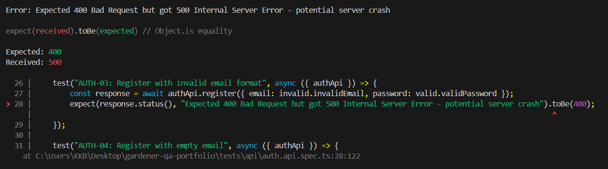
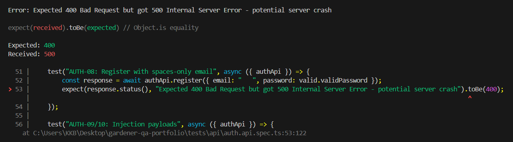

# Bug Report – BUG-004-AUTH-Validation-Crash

## Summary
Backend returns 500 Internal Server Error instead of 400 Bad Request when registering with invalid or empty email formats.

---

## Environment
| Field | Value |
|---|---|
| Backend | http://localhost:3001 |
| Database | MongoDB Cloud |
| Date found | 2026-04-26 |

---

## Severity
- [ ] Critical
- [x] Major
- [ ] Minor

---

## Status
- [x] New
- [ ] In progress
- [ ] Fixed
- [ ] Closed

---

## Related Test Case
TC ID: `AUTH-03`, `AUTH-08`

---

## Steps to Reproduce
1. Send a POST request to `/auth/register`.
2. Provide an invalid email format (e.g., `"not-an-email"`) or whitespace-only email (`"   "`).
3. Execute the request.

---

## Expected Result
Server should return **HTTP 400 Bad Request** with a validation error message.

---

## Actual Result
Server returns **HTTP 500 Internal Server Error**. The backend likely crashes when attempting to process the invalid string.

---

## Evidence

