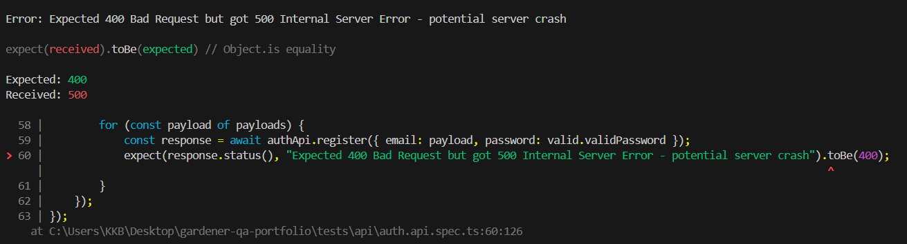

# Bug Report – BUG-005-AUTH-Injection-Crash

## Summary
Backend returns 500 Internal Server Error when processing registration payloads containing SQL or Script Injection characters.

---

## Environment
| Field | Value |
|---|---|
| Backend | http://localhost:3001 |
| Database | MongoDB Cloud |
| Date found | 2026-04-26 |

---

## Severity
- [ ] Critical
- [x] Major (Potential Security Vulnerability)
- [ ] Minor

---

## Status
- [x] New
- [ ] In progress
- [ ] Fixed
- [ ] Closed

---

## Related Test Case
TC ID: `AUTH-09`, `AUTH-10`

---

## Steps to Reproduce
1. Send a POST request to `/auth/register`.
2. Enter `' OR 1=1 --` or `` in the email field.
3. Submit the request.

---

## Expected Result
Input should be sanitized or rejected with **HTTP 400 Bad Request**.

---

## Actual Result
Server returns **HTTP 500 Internal Server Error**, indicating a lack of proper input sanitization.

---

## Evidence

