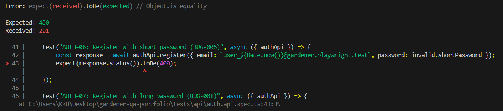

# Bug Report – BUG-006-AUTH-Short-Password

## Summary
Backend allows user registration with a password shorter than the requirement of 6 characters.

---

## Environment
| Field | Value |
|---|---|
| Backend | http://localhost:3001 |
| Database | MongoDB Cloud |
| Date found | 2026-04-26 |

---

## Severity
- [ ] Critical
- [x] Major
- [ ] Minor

---

## Status
- [x] New
- [ ] In progress
- [ ] Fixed
- [ ] Closed

---

## Related Test Case
TC ID: `AUTH-06`

---

## Steps to Reproduce
1. Send a POST request to `/auth/register`.
2. Provide a valid email and a short password: `"123"`.
3. Execute the request.

---

## Expected Result
Server should return **HTTP 400 Bad Request** and reject the registration.

---

## Actual Result
Server returns **HTTP 201 Created**. User account is successfully created with a weak password.

---

## Evidence

